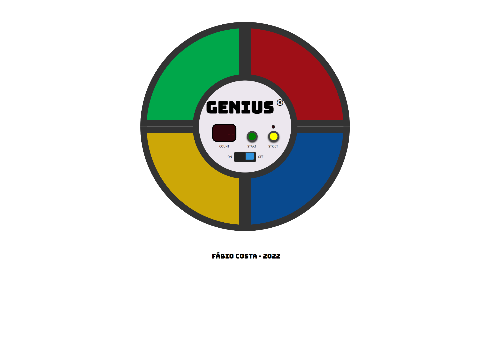

# Genius

[Clique aqui para acessar](https://fabiocosta123.github.io/jogo-genius/)

Jogo que aguça a memória. O objetivo é repetir a sequência dada pelo jogo.

Você já jogou Genius?

Genius era um brinquedo muito popular na década de 1980. Distribuído pela Estrela, o brinquedo buscava estimular a memorização de cores e sons. Com um formato semelhante a um OVNI, possuía botões coloridos que emitiam sons harmônicos e se iluminavam em sequência. Cabia aos jogadores repetir o processo sem errar.

> DOM game é um jogo feito exclusivamente com o DOM, sem canvas e sem flash. Eles são essencialmente construídos como páginas da web, onde DIVs são elementos de jogo estilizados com folhas de estilo CSS e os elementos são animados usando javascript. O objetivo nesse projeto é aprender como criar jogo com javascript para iniciantes.

Projeto inspirado pelo Inkasa Dev
#explicar como fiz o projeto
#colocar tecnologia usada no projeto
